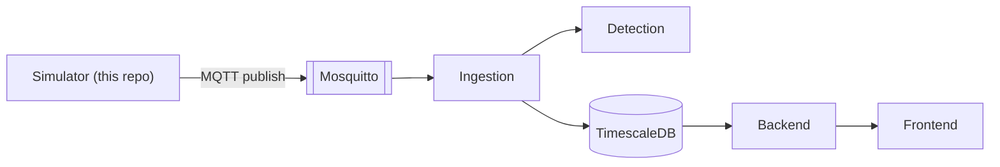
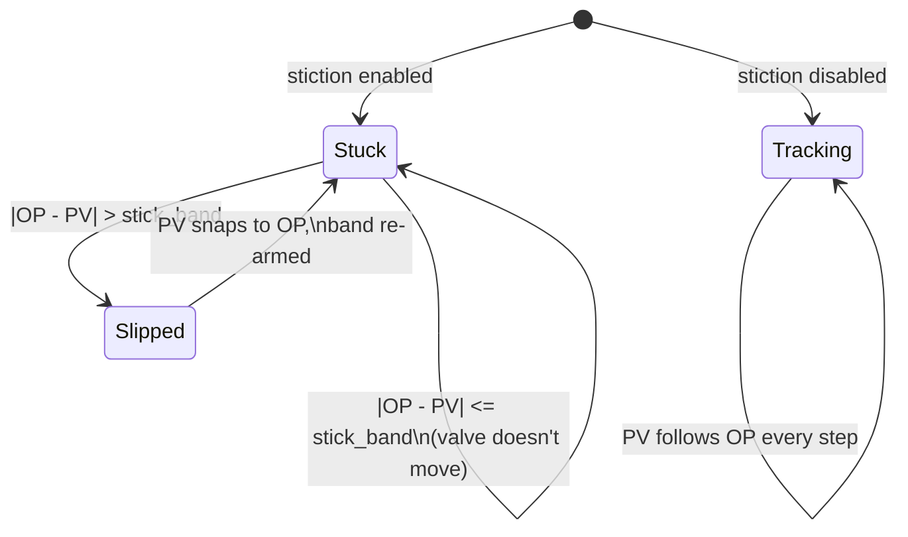

# valve-stiction-simulator

[](https://github.com/maulanaiskak/valve-stiction-simulator/actions)

Synthetic data-generator service for a distributed, real-time control-valve stiction detection pipeline. Generates a triangle-wave OP (controller output) and a stick-slip valve model's resulting PV (process variable), and streams `{sensor_id, pv, op, ts}` samples over MQTT.

**Part of a 5-repo system** — see [System Design (HLD)](https://github.com/maulanaiskak/valve-stiction-backend/blob/main/docs/HLD.md) and [Whitepaper](https://github.com/maulanaiskak/valve-stiction-backend/blob/main/docs/WHITEPAPER.md) for the full picture: a train/serve model-generalization failure found, fixed, and honestly bounded; a monolith split into 5 independently-deployable services; 99.6%/AUC 0.9998 live-streaming detection accuracy after the fix.

| Repo | Role |
|---|---|
| **simulator** (this repo) | Synthetic PV/OP signal generator |
| [ingestion](https://github.com/maulanaiskak/valve-stiction-ingestion) | MQTT subscribe, windowing, forwards to detection |
| [detection](https://github.com/maulanaiskak/valve-stiction-detection) | Classic detector + trained RF model |
| [backend](https://github.com/maulanaiskak/valve-stiction-backend) | REST + WebSocket API |
| [frontend](https://github.com/maulanaiskak/valve-stiction-frontend) | React dashboard |

## Where this fits



## The signal model

Not closed-loop PI control — that was tried and could self-oscillate from integral windup against OP saturation even with a healthy valve, confounding the exact signal this project needs to be clean. Instead, OP is directly scripted as a triangle wave (mimicking a controller actively driving the valve), and PV follows it through a stick-slip valve model: when stiction is on, PV holds at its last position until OP's deviation exceeds a stick band, then snaps to catch up.



Verified against the real classic detector (same physics as [valve-stiction-ml](https://github.com/maulanaiskak/valve-stiction-ml)'s test fixtures) in `domain/test_simulator.py`, and re-confirmed at production scale in `valve-stiction-backend/docs/STREAMING_EVALUATION.md`: `stiction=True` gives ellipse_index≈1.9/kano=True; `stiction=False` gives ellipse_index≈0.12/kano=False — a clean separation, not a coin flip.

## Architecture

Layered: `domain` (the signal-generation logic, pure computation, no I/O) → `delivery` (MQTT publishing). `main.py` is just wiring.

```
domain/simulator.py       Simulator -- triangle-wave OP + stick-slip valve model
delivery/mqtt/publisher.py MQTT connect + publish loop
```

## Run

```bash
pip install paho-mqtt numpy
MQTT_BROKER_HOST=localhost SENSOR_ID=valve-1 STICTION_ENABLED=true python main.py
```

```bash
docker build -t valve-stiction-simulator .
docker run -e MQTT_BROKER_HOST=host.docker.internal -e STICTION_ENABLED=true valve-stiction-simulator
```

| Env var | Default |
|---|---|
| `MQTT_BROKER_HOST` | `localhost` |
| `MQTT_BROKER_PORT` | `1883` |
| `MQTT_TOPIC` | `valve/data` |
| `SENSOR_ID` | `valve-1` |
| `STICTION_ENABLED` | `false` |
| `SAMPLE_INTERVAL_S`, `PERIOD_SAMPLES`, `AMPLITUDE`, `STICK_BAND`, `NOISE_STD`, `CENTER` | signal-shape tuning, see `domain/simulator.py` |

## Testing

```bash
pip install pytest
pip install git+https://github.com/maulanaiskak/valve-stiction-ml.git
pytest -v
```
